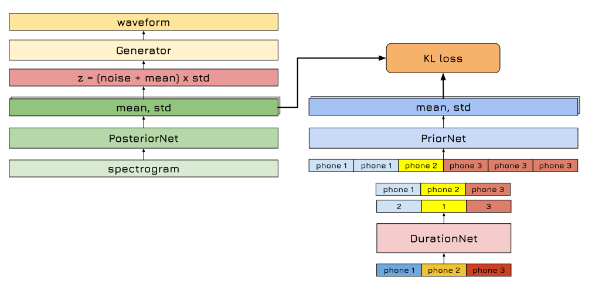

# Light Speed ⚡
Light Speed ⚡ is a modified VITS model that uses aligned phoneme durations.

## FAQ

Q: How do I create training data?  
A: See the `./prepare_ljs_tfdata.ipynb` notebook for instructions on preparing the training data.

Q: How can I train the model with 1 GPU?  
A: Run: `python train.py`

Q: How can I train the model with 4 GPUs?  
A: Run: `torchrun --standalone --nnodes=1 --nproc-per-node=4 train.py`

Q: How can I train a model to predict phoneme durations?  
A: See the `./train_duration_model.ipynb` notebook.

Q: How can I generate speech with a trained model?  
A: See the `./inference.ipynb` notebook.

## Credits

- Most of the code in this repository is based on the [VITS official repository](https://github.com/jaywalnut310/vits).
